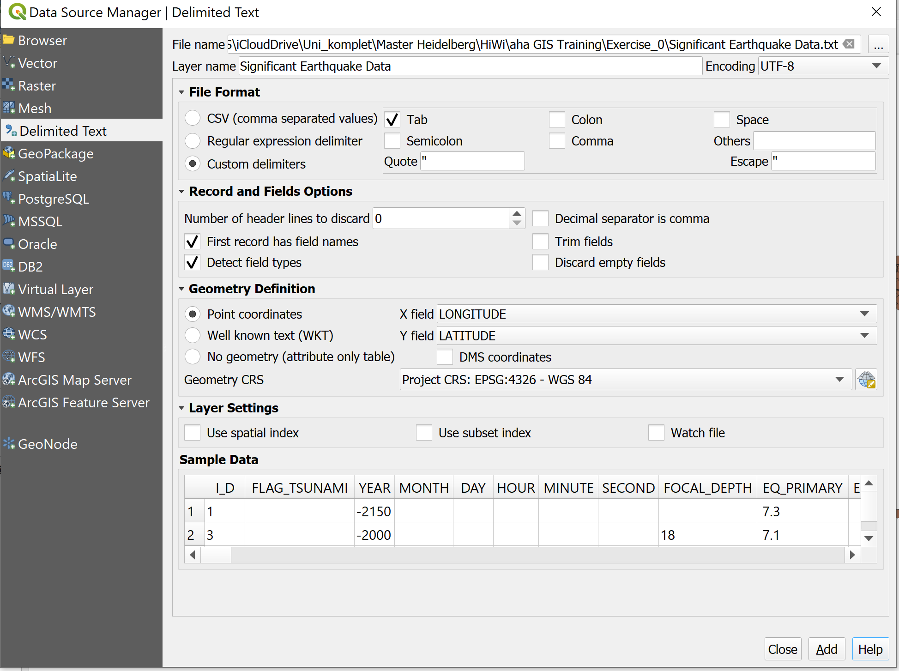
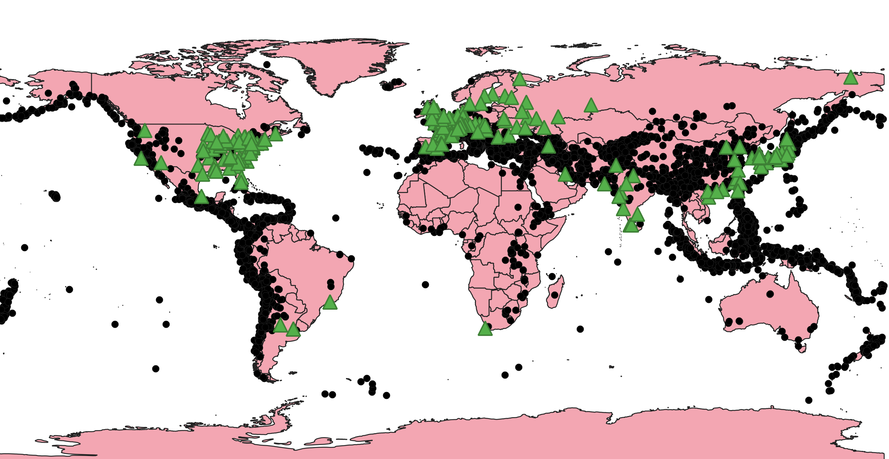

**Exercise 0**

**Aim of the exercise**

Get to know QGIS and familiarize yourself with geodata.

**Wiki:**

- [Interface](https://gitlab.com/Alec-SE/gis-in-anticipatory-humanitarian-action/-/wikis/interface)
- [Projections](https://gitlab.com/Alec-SE/gis-in-anticipatory-humanitarian-action/-/wikis/projections)
- [Layer Concept and data import](https://gitlab.com/Alec-SE/gis-in-anticipatory-humanitarian-action/-/wikis/layer-concept)

**Data:**

Download the [data](https://gitlab.com/Alec-SE/gis-in-anticipatory-humanitarian-action/-/blob/main/Exercise_0/Ex0_data.zip) and save it on your PC. Create a local folder and save the above data there. (.zip folders must be unzipped beforehand.)

- [World Countries (Generalized)](https://hub.arcgis.com/datasets/2b93b06dc0dc4e809d3c8db5cb96ba69_0/explore) (Polygon/Shapefile)
- [Significant Earthquake Database](https://www.ncei.noaa.gov/access/metadata/landing-page/bin/iso?id=gov.noaa.ngdc.mgg.hazards:G012153) (CSV)
- [Global Power Plant Database](https://datasets.wri.org/dataset/globalpowerplantdatabase) (Points/Shapefile)

**Tasks**

1. Open QGIS and create a new project. .
2. [Open the above files in QGIS](https://gitlab.com/Alec-SE/gis-in-anticipatory-humanitarian-action/-/wikis/layer-concept). Load the vector layers via Layer -> Data Source Manager -> Vector into your programme. Load the test layer file (Significant Earthquake Data) via  Layer -> Data Source Manager -> Add Delimited text Layer in your programme. While loading the text layer make sure to open the drop-down menu “File Format” and check the box “costume delimiter” and “Tab”. Furthermore select the coordinate reference system (CRS) "EPSG:4326-WGS 84".  
3. Arrange the three layers in a practical order. 
4. Interact with the map and explore the data sets. Use the zoom tool and move the map. 
5. Save your project.

**This (or similar) is what it looks like in the end:**

