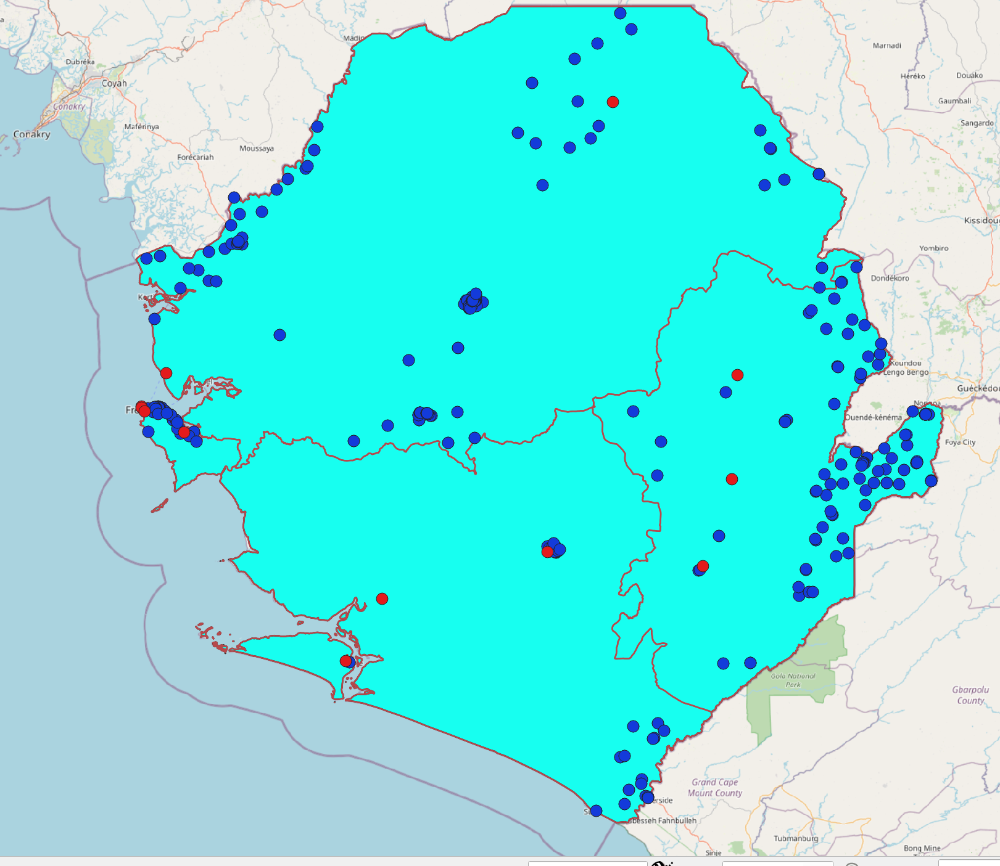

**Exercise 1**

**Aim of the exercise**

To take the first steps.
Understand the user interface and get to know the layer concept.
Display vector data in QGIS and view the attribute data.
Reproject vector data (i.e. change the projection of the data).

**Wiki:**

- [Interface](https://gitlab.com/Alec-SE/gis-in-anticipatory-humanitarian-action/-/wikis/interface)
- [Projections](https://gitlab.com/Alec-SE/gis-in-anticipatory-humanitarian-action/-/wikis/projections)
- [Layer Concept and data import](https://gitlab.com/Alec-SE/gis-in-anticipatory-humanitarian-action/-/wikis/layer-concept)

**Data:**

Download the [data](https://gitlab.com/Alec-SE/gis-in-anticipatory-humanitarian-action/-/blob/main/Exercise_1/Ex1_data.zip) and save it on your PC. Create a local folder and save the above data there. (.zip folders must be unzipped beforehand.)

-Sierra Leone national boders (Polygon/lines)
-Sierra Leone provinces (Lines)
-Sierra Leone health (Points)
-Sierra Leone airports (CSV)

**Tasks**

1. Open QGIS and familiarise yourself with the user interface.
2. Open the above files in QGIS. Load the vector layers into your programme. Load the CSV file via "Add delimited text".
3. Interact with the map and explore the data sets. Use the zoom tool and move the map. Notice the status bar at the bottom of the screen and how it changes. 
4. Familiarise yourself with the layer window (Layer List). Alternately show and hide different layers and move the layers in the hierarchy. Rename the data layer in a meaningful way. Note that the latter has no effect on the data sources (file names, storage location).
5. View the attribute data of the layers. For this purpose look at the attribute table.
6. Changes the projection in the map view to WGS 84 / Pseudo-Mercator- EPSG:3857. Note that this does not change the projection (the coordinates) of the files, but only affects the projection of the map view.  Check this in the properties of the point layer. Which projection is indicated there?
7. Now save the health layer in the projection WGS 84 / Pseudo-Mercator- EPSG:3857. This changes the projection of the file. Check this in the properties of the newly created layer.
8. Save your project. 
9. Optional: You can add the OpenStreetMap base map via the browser windows => XYZ Tiles. Note that online base maps can lead to problems with the projection of the different layers. Make sure to remove the base map bevor saving the project. 

**This (or similar) is what it looks like in the end:**

