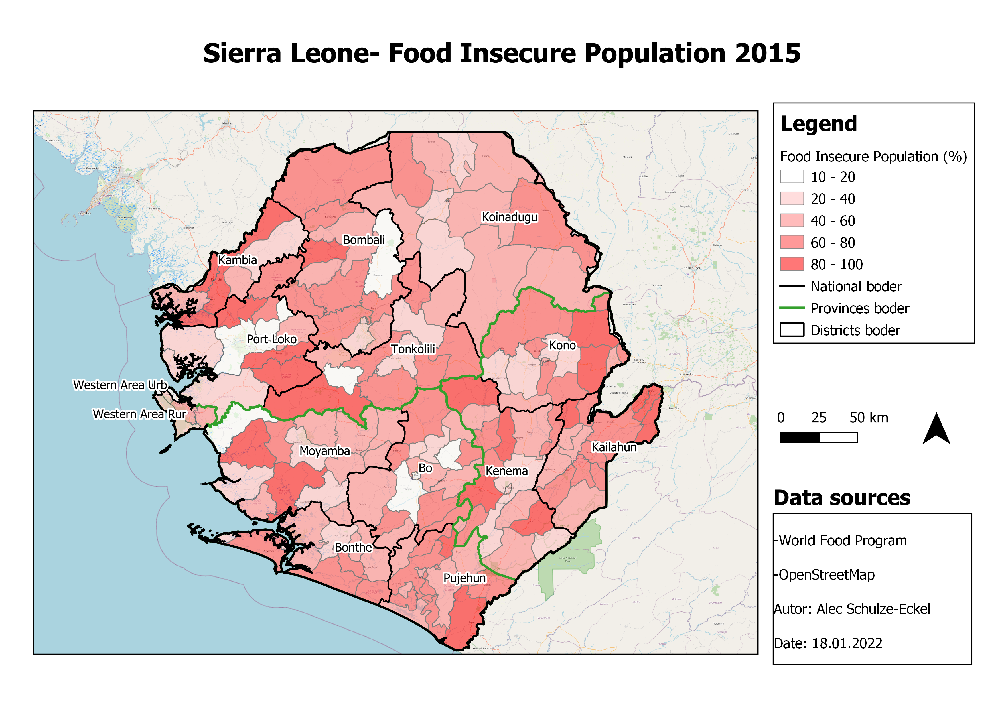

**Exercise 3**

In this scenario we will try to get a better overview of the food security situation in Sierre Leone in 2015. To do this, we will use a dataset that contains data on both the food secure population and the food insecure population. Which data you want to use is up to you.  
 

**Aim of the exercise**

Gather first experiences with the visualization tools of QGIS.
Obtain the skills to produce a printable map with QGIS.
 

**Wiki:**

- [Basemaps](https://gitlab.com/Alec-SE/gis-in-anticipatory-humanitarian-action/-/wikis/basemaps)
- [Classification of data](https://gitlab.com/Alec-SE/gis-in-anticipatory-humanitarian-action/-/wikis/Classification-of-data)
- [Styling panel](https://gitlab.com/Alec-SE/gis-in-anticipatory-humanitarian-action/-/wikis/Styling-panel)
- [Map design](https://gitlab.com/Alec-SE/gis-in-anticipatory-humanitarian-action/-/wikis/map-design)

**Data:**

Download the [data (Ex3_data)](https://gitlab.com/-/ide/project/Alec-SE/gis-in-anticipatory-humanitarian-action/tree/main/-/Exercise_3/Ex3_data.zip/) and save it on your PC. Create a local folder and save the above data there. (.zip folders must be unzipped beforehand.)

- [Sierra Leone Food Insecure Population, 2015 (data modified)](https://geonode.wfp.org/layers/geonode%3Asle_ica_admin3_recentfoodinsecurity_geonode_20170517) (Polygons) 
- [Sierra Leone national boders](https://data.humdata.org/dataset/geoboundaries-admin-boundaries-for-sierra-leone) (lines)
- [Sierra Leone provinces](https://data.humdata.org/dataset/geoboundaries-admin-boundaries-for-sierra-leone) (Lines)
- Optional [Sierra Leone health](https://data.humdata.org/dataset/sierra-leone-healthsites) (Points)
- Optional [Sierra Leone airports](Sierra Leone airports) (Points) 
- Optional [Sierra Leone roads](https://data.humdata.org/dataset/hotosm_sle_roads) (lines)- [Info](https://wiki.openstreetmap.org/wiki/Key:highway)

**Tasks**
1. Open the above files in QGIS. Load the vector layers prevalence of stunting 2014, national boders, provinces and airports into your programme.
2. Classify the  data and adjust the coloring. In this case you are dealing with metrically scaled data. This means that you have to find practical classes yourself that support the statement you want to make with your map. In the wiki you will find a video that shows how you can do this.  [Classification of data- Classification of metric scale data](https://gitlab.com/Alec-SE/gis-in-anticipatory-humanitarian-action/-/wikis/Classification-of-data). To get a better overview of the data you can check the excel sheet contained in the folder. Note that the names of the columns in the shapefile are somewhat different from the ones in the excel sheet. This is because in shapefiles you only have a limited number of signs you can use. 
3. (Optional) If you think that additional data in your map would help in a way you can add them. 
4. Great a print layout and add features like title, sources, scales, legend and North arrow. See wiki [Map design](https://gitlab.com/Alec-SE/gis-in-anticipatory-humanitarian-action/-/wikis/map-design) 
5. Export your map as PDF.

**Extra Task:**
Is there an option to visualize the food insecurity data **AND** the stunting data from exercise_2 in one map? If yes, can you create one?

##This (or similar) is what it looks like in the end:

 

