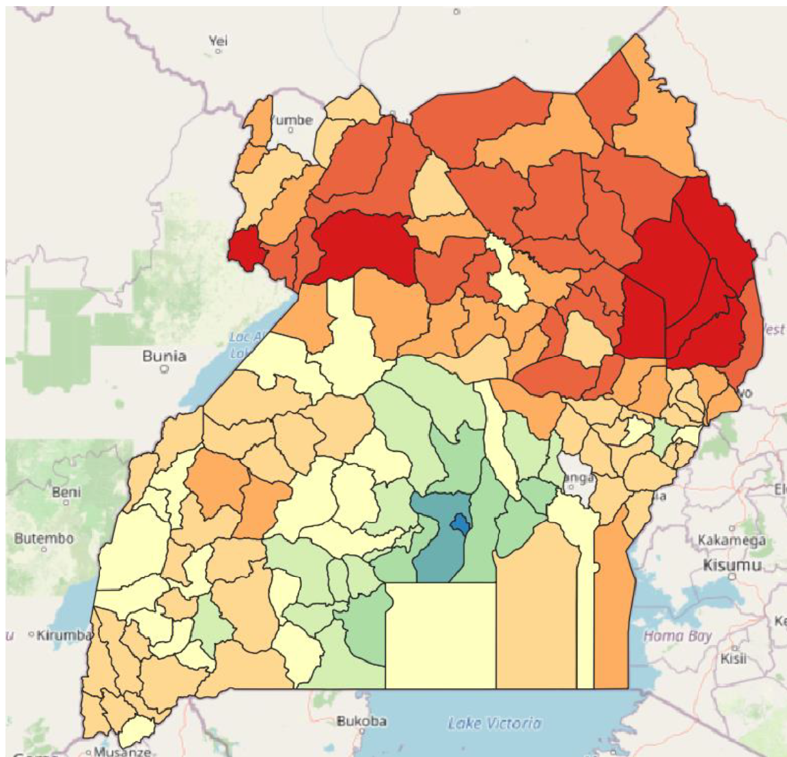
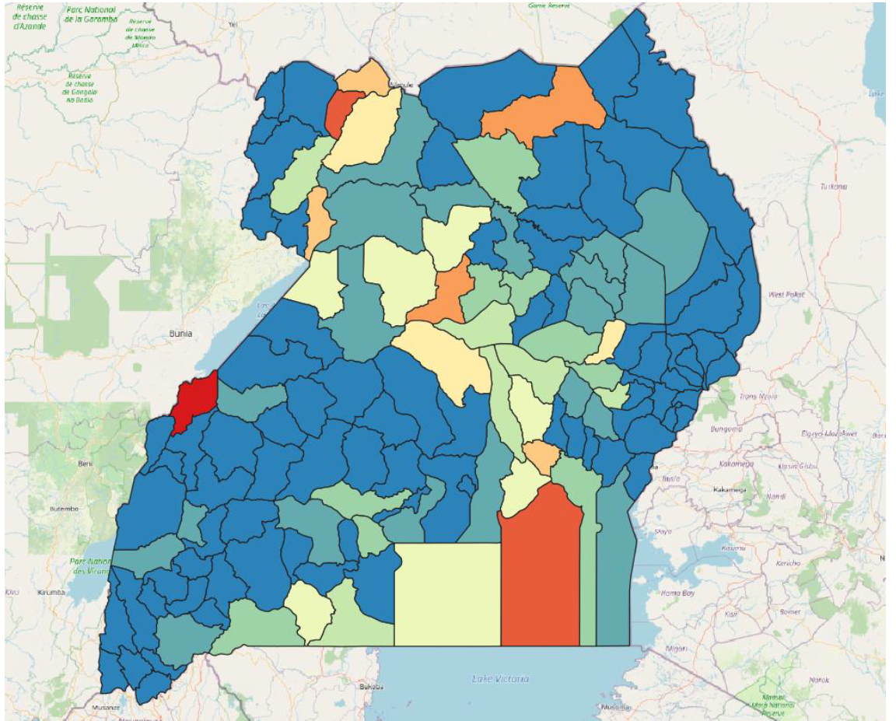
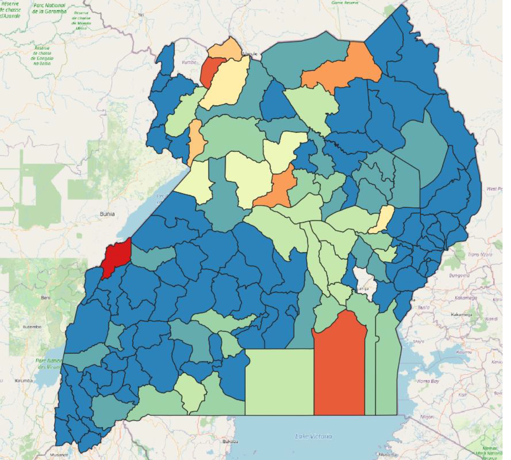

**Exercise 6**

**Aim of the exercise**

We want to create a risk map for floods in Uganda. For this we want to first make an overview of different vulnerability and lack of coping capacity indicators. From the Covid-19 risk indicators dataset we take % permanent wall type, % permanent roof type and poverty incidence. From the Uganda population statistics we calculate the % of under fives and % of elderly. We combine the data and we can visualize where are the most vulnerable areas in Uganda.
Then we look at the exposure. For this we look at the amount of people that live in an area that would be inundated when a flood with a magnitude of 10 years return period would occur. Then we can calculate the percentage of people per district that are exposed to these floods and we can visualize the exposed areas in Uganda.
Finally we will combine the two maps to calculate the risk by multiplying the vulnerability with the exposure.

**Wiki:**

- [Basemaps](https://gitlab.com/Alec-SE/gis-in-anticipatory-humanitarian-action/-/wikis/basemaps)
- [Classification of data](https://gitlab.com/Alec-SE/gis-in-anticipatory-humanitarian-action/-/wikis/Classification-of-data)
- [Styling panel](https://gitlab.com/Alec-SE/gis-in-anticipatory-humanitarian-action/-/wikis/Styling-panel)
- [Map design](https://gitlab.com/Alec-SE/gis-in-anticipatory-humanitarian-action/-/wikis/map-design)

**Data:**

Download the [data]() and save it on your PC. Create a local folder and save the above data there. (.zip folders must be unzipped beforehand.)

- [Uganda district boundaries](https://data.humdata.org/dataset/uganda-administrative-boundaries-admin-1-admin-3) 
- [Uganda population statistics](https://data.humdata.org/dataset/uganda-administrative-level-population-statistics#)
- [Covid-19 risk indicators](https://data.humdata.org/dataset/covid19_risk_index)
- [Population](https://data.humdata.org/dataset/highresolutionpopulationdensitymaps-uga)
- [10 year return period flood inundation area](https://data.jrc.ec.europa.eu/dataset/jrc-floods-floodmapgl_rp10y-tif)

**Tasks: Vulnerability index **
1. We start by loading in the datasets with the vulnerability indicators. The covid 19 shapefile, the population statistics csv and the admin boundaries level 2 (district). The population statistics and the admin boundaries are linked through the P code.
2. Before you start doing any GIS operations, explore the data. Always check if the projection is the same.
3. We see that the shape and amount of the polygons are different! Probably the risk data is using an older version of the admin boundaries.
4. 2 things we can do
	a. We can take the closest district centrepoint (from the many to the fewer records dataset). This is the one we will do today as the difference is not drastically.
	b. Rasterize and then zonal statistics with mean on the other polygons.
5. Vector --> geometry centroids. On the shapes with the most elements (the admin 2 boundaries).
6. Edit the points so they fall within the right polygons. This needs to happen because sometimes the centroid of a polygon falls outside of the polygon when it has a weird shape.
7. There is actually an issue which we will find out by joining the datasets but it can be solved by using the fix geometries tool on the covid-19 risk dataset.
8. Join attributes by location, 1st points and 2nd covidrisk polygons, select within, select the columns wall, roof and poverty incidence to add.
9. Again join attributes by location, 1st level 2 boundaries and 2nd points_joined layer, select contain and again the three columns --> uga_2_with_covid_risk
10. Now, join attributes by field value uga_2_with_covid_risk (on column adm2_pcode) to the csv uga_admpop ( on column adm2_pcode)
11. On the result, open the field calculator to calculate a new decimal number type field %U5 = 
`( "M_00" + "M_01" + "M_02" + "M_03" + "M_04" + "F_00" + "F_01" + "F_02" + "F_03" + "F_04" ) / "Total"`
12. Again, open the field calculator to calculate a new decimal number type field %Above65 =
`( "M_65" + "M_66" + "M_67" + "M_68" + "M_69" + "M_70" + "M_71" + "M_72" + "M_73" + "M_74" + "M_75" + "M_76" + "M_77" + "M_78" + "M_79" + "M_80plus" + "F_65" + "F_66" + "F_67" + "F_68" + "F_69" + "F_70" + "F_71" + "F_72" + "F_73" + "F_74" + "F_75" + "F_76" + "F_77" + "F_78" + "F_79" + "F_80plus" )/ "Total"`  
13. Again, open the field calculator to calculate a new decimal number type field %U5indicator = ( "%U5" - minimum( "%U5" )) / (maximum( "%U5" ) - minimum( "%U5" )) * 10
14. Again, open the field calculator to calculate a new decimal number type field %Above65indicator
15. Delete unnecessary fields from the attribute table.
16. Again, open field calculator to calculate average of vulnerabilities = `((10- "%permrooft" )+(10- "%permwallt" )+ "Povertyinc" + "%U5indicator" + "%Above65indicator" )/5` 
17. Save and stop editing
18. Make a symbology on the final field to visualize the difference in vulnerability

##This (or similar) is what it looks like in the end:

 

**Tasks: exposure**
1. Use the raster calculator to have flooded area as 1: `"floodMapGL_rp10y@1" > 0`
2. Multiply flooded area by the population: ` "uga_general_2020@1" * "flood@1"` You want to use the cell size and extend of the population layer (the finer resolution) to not lose any information so make sure to click on ‘Selected Layer Extent’ for the population layer.
3. Use Zonal statistics on exposed population with the vulnerability polygons of the last exercise. Output prefix should be ‘pop_exp_’ and statistic is sum
4. Use Zonal statistics on total population with the resulting layer of step 3. Output prefix should be ‘total_pop_’ and statistic is sum.
5. On the resulting layer open the field calculator and calculate "pop_exp_sum" / "total_pop_sum", make sure to select the decimal number type.
6. Again, use the field calculator to normalize the exposed index` ( "exposure_indicator" - minimum( "exposure_indicator" )) / (maximum( "exposure_indicator" ) - minimum( "exposure_indicator" )) * 10`
7. Save and end editing mode
8. Visualize the result

##This (or similar) is what it looks like in the end:

 

**Tasks: combination of exposure and vulnerability**
1. Field calculator and multiply the vulnerability with the exposure.
2. Save and end the editing.
3. Visualize the result

##This (or similar) is what it looks like in the end:

 

**Tasks: Classification of exposure**
1. In the exposure calculation we did a very simplified normalization of the percentage of people but let’s say we want to classify this in a more reasonable way as:
2. On the website of the JRC you can also download a dataset for 20 year return period floods. Do the exposure calculation based on that layer.
3. Find another vulnerability or lack of coping capacity dataset on HDX or somewhere else and add it to the vulnerability calculation.

##This (or similar) is what it looks like in the end:

 
